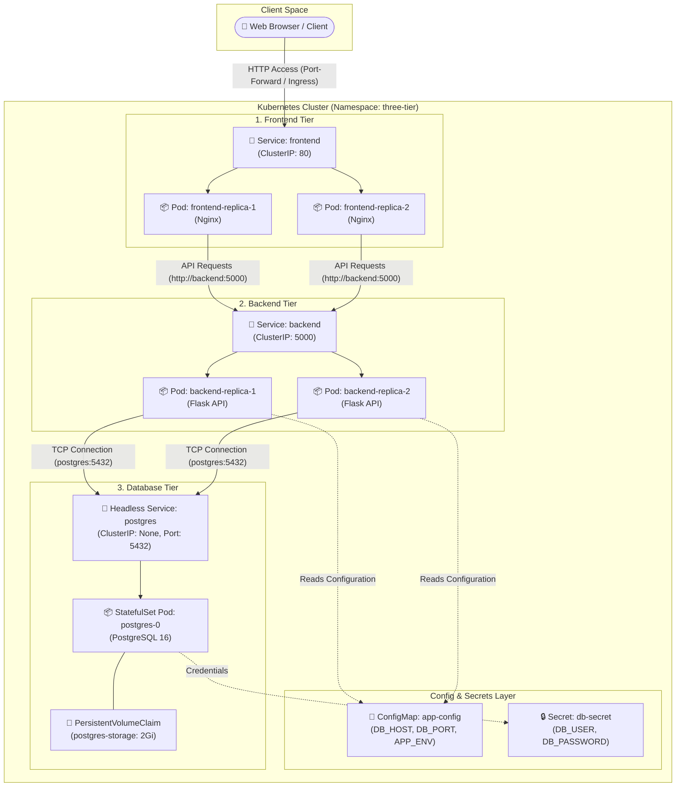

# 🚀 Cloud-Native 3-Tier Web Application on Kubernetes

[](https://kubernetes.io/)
[](https://www.docker.com/)
[](https://www.python.org/)
[](https://flask.palletsprojects.com/)
[](https://nginx.org/)
[](https://www.postgresql.org/)

A production-ready, cloud-native **3-Tier Web Application Architecture** fully orchestrated on **Kubernetes (K8s)**. This repository showcases industry best practices for containerizing and deploying multi-tier applications with isolated namespaces, persistent stateful storage, decoupled configuration, zero-downtime health probes, and resource quota constraints.

---

## 📐 Architecture Overview

The application is structured into three distinct layers running inside a dedicated `three-tier` Kubernetes namespace:

1. **Frontend Tier**: Nginx web server delivering lightweight static HTML/JS assets. Deployed via a K8s **Deployment** (2 replicas) and exposed internally via a **ClusterIP Service**.
2. **Backend Tier**: Python Flask RESTful API handling business logic and system status requests. Deployed via a K8s **Deployment** (2 replicas) with configured **Startup**, **Readiness**, and **Liveness** probes. Exposed internally via a **ClusterIP Service**.
3. **Database Tier**: PostgreSQL 16 database preserving state. Deployed using a K8s **StatefulSet** (1 replica) paired with a **Headless Service** (`clusterIP: None`) for stable network identifiers and a **PersistentVolumeClaim (PVC)** requesting 2Gi of durable storage.

### 📊 System Architecture Diagram



---

## 📂 Repository Structure

```text
three-tier-k8s/
├── namespace.yaml           # Kubernetes Namespace definition ('three-tier')
├── configmap.yaml           # Application environment configurations
├── secret.yaml              # Encrypted database credentials (Base64)
├── frontend/
│   ├── deployment.yaml      # Frontend K8s Deployment (2 Replicas, Nginx)
│   ├── service.yaml         # Frontend ClusterIP Service (Port 80)
│   └── app/
│       ├── Dockerfile       # Nginx container image build spec
│       ├── index.html       # Web application entry point
│       └── nginx.conf       # Custom Nginx server configuration
├── backend/
│   ├── deployment.yaml      # Backend K8s Deployment (2 Replicas, Flask)
│   ├── service.yaml         # Backend ClusterIP Service (Port 5000)
│   └── app/
│       ├── Dockerfile       # Python 3.12 slim build spec
│       ├── app.py           # Flask API endpoints (/ and /health)
│       └── requirements.txt # Python dependencies (Flask, psycopg2-binary)
└── database/
    ├── statefulset.yaml     # PostgreSQL K8s StatefulSet & VolumeClaimTemplate
    ├── service.yaml         # Headless Service definition (ClusterIP: None)
    └── pvc.yaml             # PersistentVolumeClaim (2Gi)
```

---

## ✨ Key Features & Best Practices

- **Namespace Isolation**: All components are organized under a dedicated `three-tier` namespace to prevent resource naming collisions and ensure scope control.
- **Stateful vs Stateless Segregation**:
  - Stateless frontend and backend apps use **Deployments** for standard horizontal scaling.
  - The relational database uses a **StatefulSet** with `volumeClaimTemplates` to guarantee persistent identity and storage across pod restarts.
- **Robust Health Monitoring**:
  - **Startup Probes**: Protect slow-starting application routines (`failureThreshold: 30`, `periodSeconds: 5`).
  - **Readiness Probes**: Ensure traffic is only routed to pods once they are ready to accept connections.
  - **Liveness Probes**: Automatically restart failed or hung containers.
- **Resource Management**: Enforced CPU and memory `requests` and `limits` to ensure efficient node scheduling and prevent resource starvation.
- **Security & Decoupled Configuration**: Sensitive DB credentials are stored in Kubernetes `Secrets` while non-sensitive parameters reside in a `ConfigMap`.

---

## 🛠️ Prerequisites

Before deploying, make sure you have:
1. A running Kubernetes cluster (e.g., **Minikube**, **Kind**, **Docker Desktop K8s**, **EKS**, **GKE**, or **AKS**).
2. `kubectl` CLI tool installed and configured to communicate with your cluster.
3. `docker` (optional, only required if rebuilding images).

---

## 🚀 Step-by-Step Deployment Guide

### 1️⃣ Clone the Repository
```bash
git clone https://github.com/enacton-interns/Madhav-repo.git
cd Madhav-repo/three-tier-k8s
```

### 2️⃣ Create the Namespace
Create the dedicated namespace to isolate our resources:
```bash
kubectl apply -f namespace.yaml
```

### 3️⃣ Apply Configurations & Secrets
Deploy the ConfigMap and Secret:
```bash
kubectl apply -f configmap.yaml
kubectl apply -f secret.yaml
```

### 4️⃣ Deploy the Database Tier
Launch the PostgreSQL StatefulSet, PVC, and Headless Service:
```bash
kubectl apply -f database/
```

### 5️⃣ Deploy the Backend Tier
Deploy the Flask API Deployment and ClusterIP Service:
```bash
kubectl apply -f backend/
```

### 6️⃣ Deploy the Frontend Tier
Deploy the Nginx web server Deployment and ClusterIP Service:
```bash
kubectl apply -f frontend/
```

---

### ⚡ One-Line Automated Deployment
Alternatively, deploy the complete 3-tier architecture with a single command:
```bash
kubectl apply -f namespace.yaml -f configmap.yaml -f secret.yaml -f database/ -f backend/ -f frontend/
```

---

## 🔍 Verification & Testing

### Verify Resources Status
Check that all pods, services, deployments, and statefulsets are in the `Running` state:

```bash
kubectl get all -n three-tier
```

Expected Output:
```text
NAME                            READY   STATUS    RESTARTS   AGE
pod/backend-6677bc9557-2x4pl    1/1     Running   0          45s
pod/backend-6677bc9557-m6q9z    1/1     Running   0          45s
pod/frontend-57c5d4b584-85klq   1/1     Running   0          30s
pod/frontend-57c5d4b584-p9zxl   1/1     Running   0          30s
pod/postgres-0                  1/1     Running   0          60s

NAME               TYPE        CLUSTER-IP   EXTERNAL-IP   PORT(S)    AGE
service/backend    ClusterIP   10.96.12.34  <none>        5000/TCP   45s
service/frontend   ClusterIP   10.96.56.78  <none>        80/TCP     30s
service/postgres   ClusterIP   None         <none>        5432/TCP   60s

NAME                       READY   UP-TO-DATE   AVAILABLE   AGE
deployment.apps/backend    2/2     2            2           45s
deployment.apps/frontend   2/2     2            2           30s

NAME                          READY   AGE
statefulset.apps/postgres     1/1     60s
```

Check Persistent Volume Claims:
```bash
kubectl get pvc -n three-tier
```

---

## 🌐 Accessing the Application

Since services are configured as `ClusterIP` for internal security, use Kubernetes port-forwarding to access them locally:

### Access the Frontend Web UI
Forward local port `8080` to the frontend service:
```bash
kubectl port-forward service/frontend 8080:80 -n three-tier
```
Open your browser and navigate to: [http://localhost:8080](http://localhost:8080)

### Access the Backend API directly
Forward local port `5000` to the backend service:
```bash
kubectl port-forward service/backend 5000:5000 -n three-tier
```
Test the API endpoint using `curl` or your browser:
```bash
curl http://localhost:5000/
```
Response:
```json
{
  "database_host": "postgres",
  "environment": "production",
  "message": "Backend is running!"
}
```

Check API health endpoint:
```bash
curl http://localhost:5000/health
```

---

## ⚙️ Configuration Reference

### Environment Variables (`ConfigMap: app-config`)
| Variable | Value | Description |
| :--- | :--- | :--- |
| `DB_HOST` | `postgres` | Hostname of the PostgreSQL headless service |
| `DB_PORT` | `5432` | Database communication port |
| `APP_ENV` | `production` | Execution environment |

### Database Credentials (`Secret: db-secret`)
| Secret Key | Default Encoded Value | Plaintext Equivalent |
| :--- | :--- | :--- |
| `DB_USER` | `cG9zdGdyZXM=` | `postgres` |
| `DB_PASSWORD` | `cGFzc3dvcmQxMjM=` | `password123` |

> ⚠️ **Security Note**: Never commit unencrypted production secrets to public repositories. Use tools like **Sealed Secrets** or **HashiCorp Vault** for production deployments.

---

## 🐳 Building Custom Container Images

If you modify the source code, rebuild and push your Docker images:

### Backend Image
```bash
cd backend/app
docker build -t your-dockerhub-username/three-tier-backend:v1 .
docker push your-dockerhub-username/three-tier-backend:v1
```

### Frontend Image
```bash
cd frontend/app
docker build -t your-dockerhub-username/three-tier-frontend:v1 .
docker push your-dockerhub-username/three-tier-frontend:v1
```

Update the `image:` fields in `backend/deployment.yaml` and `frontend/deployment.yaml` accordingly before running `kubectl apply`.

---

## 🧹 Cleanup

To delete all resources and remove the `three-tier` namespace:

```bash
kubectl delete namespace three-tier
```

---

## 🤝 Contributing

Contributions, issues, and feature requests are welcome! Feel free to check the issues page or submit a pull request.

---

## 📜 License

Distributed under the MIT License. See `LICENSE` for more information.
